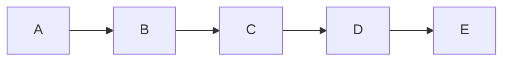
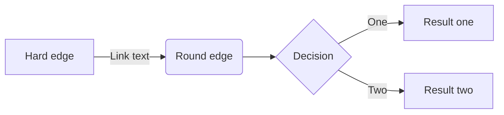
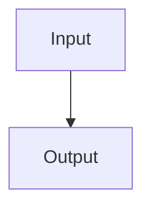
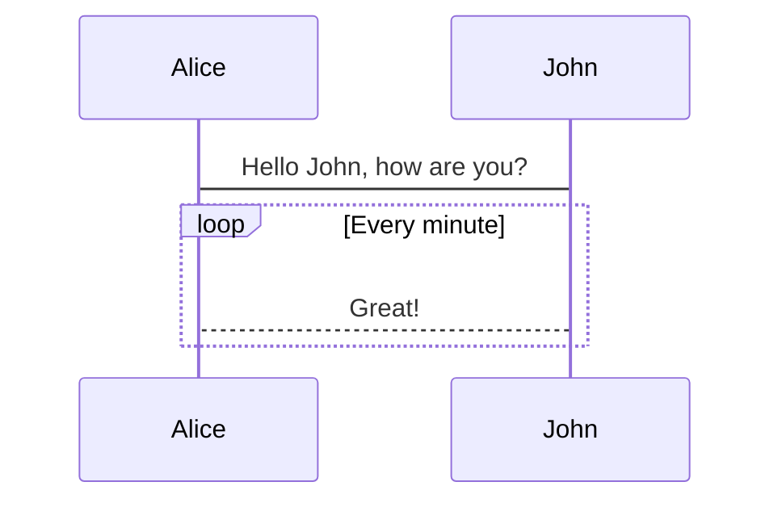

# md-elements

Cool MD elements I have come across

## Mermaid Graphs

### Flowchart











### Sequence diagram



### Class diagram

```mermiad
classDiagram
    Animal <|-- Duck
    Animal <|-- Fish
    Animal <|-- Zebra
    Animal : +int age
    Animal : +String gender
    Animal: +isMammal()
    Animal: +mate()
    class Duck{
        +String beakColor
        +swim()
        +quack()
    }
    class Fish{
        -int sizeInFeet
        -canEat()
    }
    class Zebra{
        +bool is_wild
        +run()
    }
```

## STL Viewer

```stl
solid cube_corner
  facet normal 0.0 -1.0 0.0
    outer loop
      vertex 0.0 0.0 0.0
      vertex 1.0 0.0 0.0
      vertex 0.0 0.0 1.0
    endloop
  endfacet
  facet normal 0.0 0.0 -1.0
    outer loop
      vertex 0.0 0.0 0.0
      vertex 0.0 1.0 0.0
      vertex 1.0 0.0 0.0
    endloop
  endfacet
  facet normal -1.0 0.0 0.0
    outer loop
      vertex 0.0 0.0 0.0
      vertex 0.0 0.0 1.0
      vertex 0.0 1.0 0.0
    endloop
  endfacet
  facet normal 0.577 0.577 0.577
    outer loop
      vertex 1.0 0.0 0.0
      vertex 0.0 1.0 0.0
      vertex 0.0 0.0 1.0
    endloop
  endfacet
endsolid
```

```stl
norm[a_] := Sqrt[a.a];
ePot[{x_, y_}, {px_, py_, q_}] := q/norm[{x, y} - {px, py}];
Plot3D[Dipole1[x, y], {x, -3, 3}, {y, -3, 3}, Mesh -> 17, 
 ImageSize -> 1500, PlotPoints -> 150, Lighting -> "Neutral", 
 Boxed -> False, Axes -> False, 
 PlotTheme -> {"FilledSurface", "ZMesh"}, 
 ColorFunction -> "TemperatureMap", MeshStyle -> Thickness[0.002], 
 PerformanceGoal -> "Quality", 
 Background -> RGBColor[0.95, 0.95, 0.95]]
 ```
